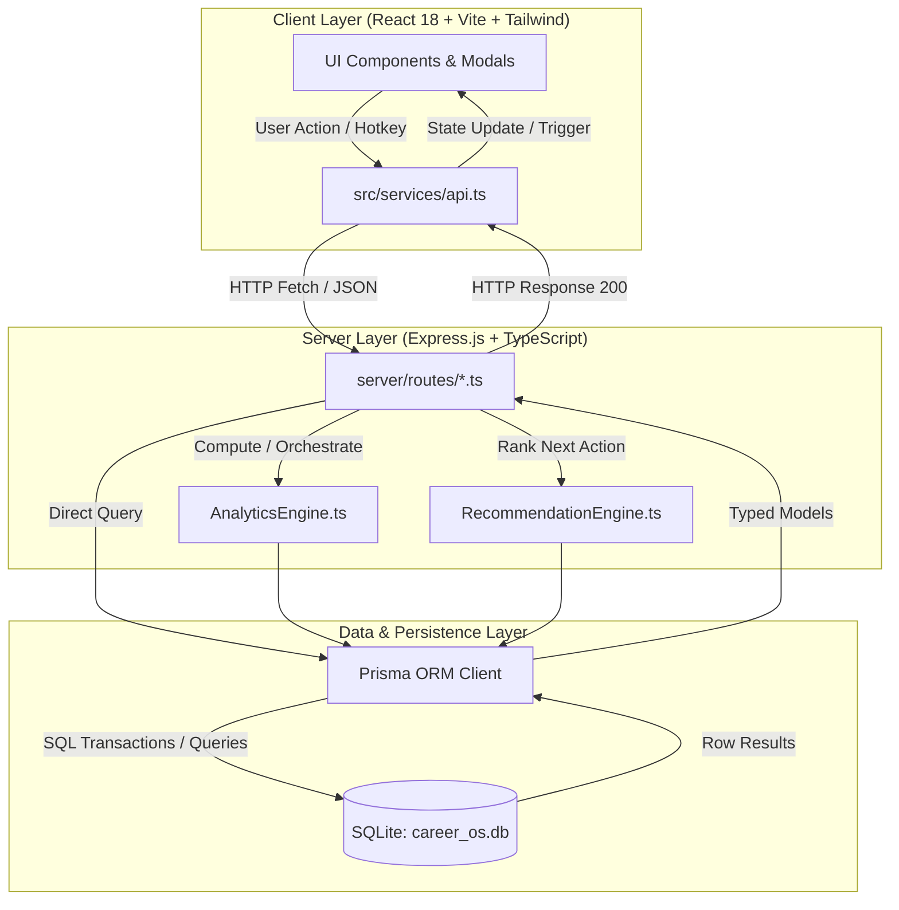
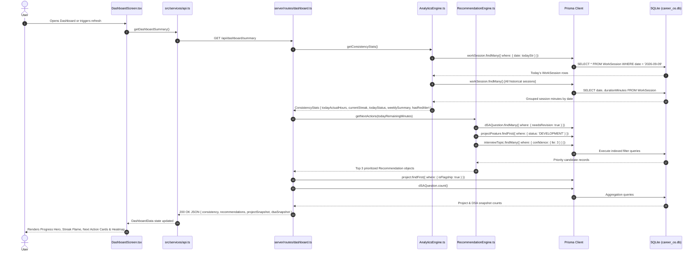
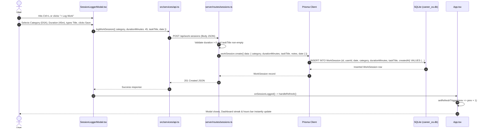
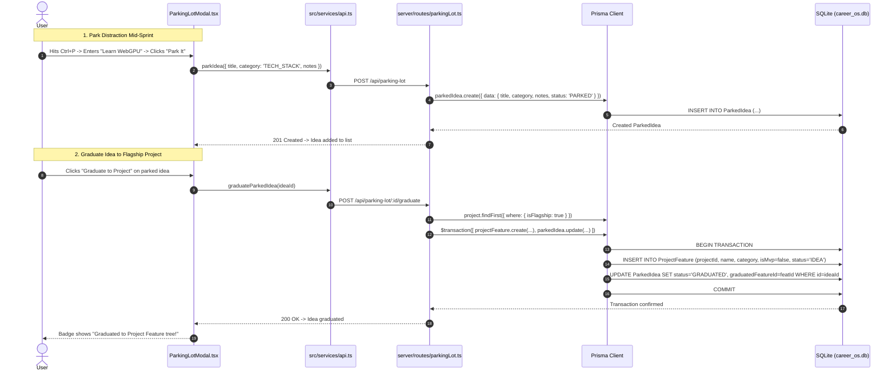
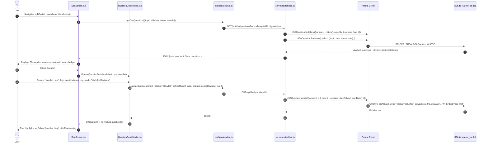
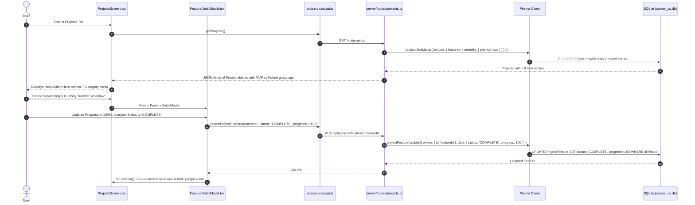
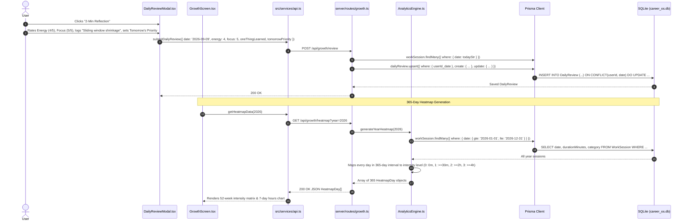
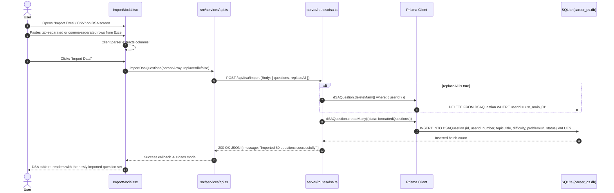
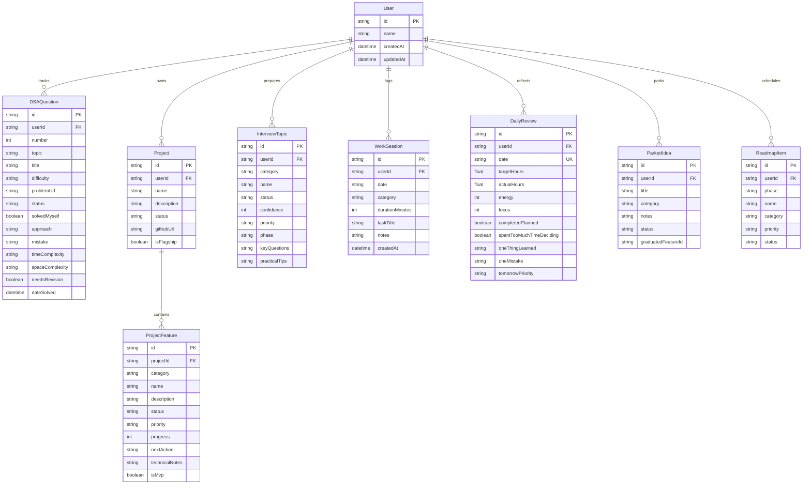

# 🌊 CareerOS: End-to-End System Architecture & Data Flows

This document provides a comprehensive technical breakdown of how data flows through **CareerOS** for every core feature — from the **Frontend Component UI** and **API Client** to the **Express Server Routing**, **Service Engines**, **Prisma ORM Queries**, and **SQLite Database Storage**.

---

## 🏛️ High-Level Layered Architecture

---

## 🔁 Feature Flow 1: Master Dashboard & Smart Recommendation Engine

Eliminates study decision paralysis by computing today's progress, active streaks, 30m micro-win state, and the top 3 highest-leverage actions to do right now.

### Detailed Trace
1. **Frontend Trigger**: `DashboardScreen.tsx` mounts or receives a `refreshTrigger` increment.
2. **API Request**: `api.getDashboardSummary()` sends `GET /api/dashboard/summary`.
3. **Server Execution**:
   - `server/routes/dashboard.ts` invokes `AnalyticsEngine.getConsistencyStats()`.
   - Computes:
     - `todayActualHours = sum(todaySessions.durationMinutes) / 60`
     - `todayStatus`: `'TARGET_MET'` if $\ge 4\text{h}$, `'STUDIED_PACE'` if $\ge 30\text{m}$, else `'INACTIVE'`.
     - `currentStreak`: Iterates backwards day-by-day counting days where $\text{loggedMinutes} \ge 30$.
     - `hasRedAlert`: Flags `true` if previous 2 consecutive days had 0 minutes logged.
   - Invokes `RecommendationEngine.getNextActions()`:
     - Priority 1: Top un-reviewed or revision DSA question from the current active topic.
     - Priority 2: Next concrete actionable feature from `GridOps Platform`.
     - Priority 3: Lowest confidence interview topic score ($\le 3/5$).
4. **Database Response**: SQLite returns matched records via Prisma.
5. **UI Update**: `DashboardScreen.tsx` renders the hero target bar, streak pill, and 3 one-click start buttons.

---

## ⚡ Feature Flow 2: Fast Work Session Logging (< 10s Execution Capture)

Captures verified deep work in under 10 seconds and instantly updates the consistency bar chart and streak counter.

### Detailed Trace
1. **Frontend Trigger**: User hits global shortcut **`Ctrl + L`** or clicks **`+ Log Work`** in header.
2. **Form State**: Category chips (`DSA`, `PROJECT`, `INTERVIEW`, `OTHER`), quick-pick duration badges (`15m`, `30m`, `45m`, `1h`, `1.5h`, `2h`), and task input.
3. **API Request**: `api.logWorkSession()` dispatches `POST /api/work-sessions`.
4. **Server Handling**:
   - `server/routes/sessions.ts` verifies session payload.
   - Executes `prisma.workSession.create()`.
5. **Database Execution**: SQLite inserts row into `WorkSession` table.
6. **Reactivity**: `App.tsx` increments `refreshTrigger`, prompting `DashboardScreen` and `Header` to re-fetch summary and re-render progress meters.

---

## 🅿️ Feature Flow 3: Parking Lot (Distraction Capture & Graduation)

Protects sprint focus by parking shiny new tools, frameworks, and side ideas in 5 seconds, with one-click graduation into the project feature tree.

### Detailed Trace
1. **Distraction Capture**: Hit **`Ctrl + P`** from any page.
2. **API Call**: `POST /api/parking-lot` with title, category, and notes.
3. **Database Insertion**: Stored in `ParkedIdea` table with `status = 'PARKED'`.
4. **Triage & Graduation**: During weekly review, clicking *"Graduate to Project"* calls `POST /api/parking-lot/:id/graduate`.
5. **Prisma Transaction**: In a single `$transaction`, creates a new `ProjectFeature` under the flagship project (`GridOps`) and updates the `ParkedIdea` status to `'GRADUATED'`.

---

## 🎯 Feature Flow 4: Locked 80-Question DSA Tracker

Tracks the curated 80-question curriculum across 9 topic modules with metacognitive solving metrics (*"Solved Myself"* vs *"Needed Help"* and *Mistake Log*).

---

## 🛠️ Feature Flow 5: Flagship Project Tree (GridOps Platform)

Manages the core MVP features, domain lifecycle states, and next immediate engineering actions for the **GridOps: Utility Grievance & Lifecycle Platform**.

---

## 📝 Feature Flow 6: 2-Minute Daily Growth & Consistency Heatmap

Locks in learnings at the end of each day, tracks decision paralysis loops, and generates the 365-day GitHub consistency heatmap.

---

## 📥 Feature Flow 7: In-App Excel / CSV / JSON Importer

Allows bulk dataset loading (such as 80 questions from Excel or custom project backlog features) without manual database scripting.

---

## 🗄️ Database Entity-Relationship (ER) Schema

---

## 🛠️ Summary of API Endpoints

| Category | HTTP Method & Route | Handled In | Key Database Model | Primary Output |
| :--- | :--- | :--- | :--- | :--- |
| **Dashboard** | `GET /api/dashboard/summary` | `server/routes/dashboard.ts` | `WorkSession`, `DSAQuestion`, `Project` | Streaks, hours, next actions & snapshot counts |
| **Work Sessions** | `GET /api/work-sessions` | `server/routes/sessions.ts` | `WorkSession` | History of logged sessions |
| **Work Sessions** | `POST /api/work-sessions` | `server/routes/sessions.ts` | `WorkSession` | Creates verified work log |
| **Work Sessions** | `DELETE /api/work-sessions/:id`| `server/routes/sessions.ts` | `WorkSession` | Removes accidentally logged session |
| **DSA Tracker** | `GET /api/dsa/questions` | `server/routes/dsa.ts` | `DSAQuestion` | 80 questions + dynamic topic percent stats |
| **DSA Tracker** | `PUT /api/dsa/questions/:id` | `server/routes/dsa.ts` | `DSAQuestion` | Updates solve state, mistakes & revision tag |
| **DSA Tracker** | `POST /api/dsa/import` | `server/routes/dsa.ts` | `DSAQuestion` | Bulk batch insert/replace |
| **Projects** | `GET /api/projects` | `server/routes/projects.ts` | `Project`, `ProjectFeature` | Flagship system feature tree |
| **Projects** | `PUT /api/projects/features/:id`| `server/routes/projects.ts`| `ProjectFeature` | Updates feature status, progress & next action |
| **Projects** | `POST /api/projects/import` | `server/routes/projects.ts` | `ProjectFeature` | Bulk imports features into project |
| **Parking Lot** | `GET /api/parking-lot` | `server/routes/parkingLot.ts` | `ParkedIdea` | List of parked distractions |
| **Parking Lot** | `POST /api/parking-lot` | `server/routes/parkingLot.ts` | `ParkedIdea` | Quick 5-second distraction capture |
| **Parking Lot** | `POST /api/parking-lot/:id/graduate`| `server/routes/parkingLot.ts`| `ParkedIdea`, `ProjectFeature` | Transactional graduation to Project feature |
| **Daily Growth** | `GET /api/growth/heatmap` | `server/routes/growth.ts` | `WorkSession` | 365-day intensity block matrix |
| **Daily Growth** | `GET /api/growth/review` | `server/routes/growth.ts` | `DailyReview`, `WorkSession` | Today's reflection + day's total minutes |
| **Daily Growth** | `POST /api/growth/review` | `server/routes/growth.ts` | `DailyReview` | Upserts daily reflection form |
| **Roadmap** | `GET /api/roadmap` | `server/routes/roadmap.ts` | `RoadmapItem`, `DSAQuestion` | Phase 1 vs Phase 2 milestones & metrics |
