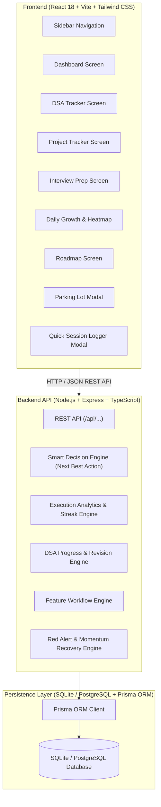
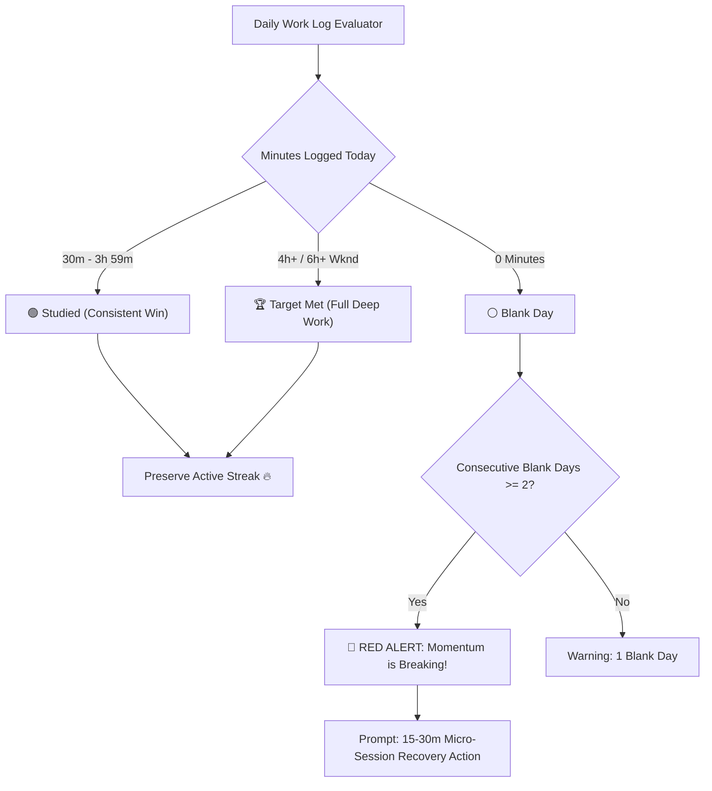
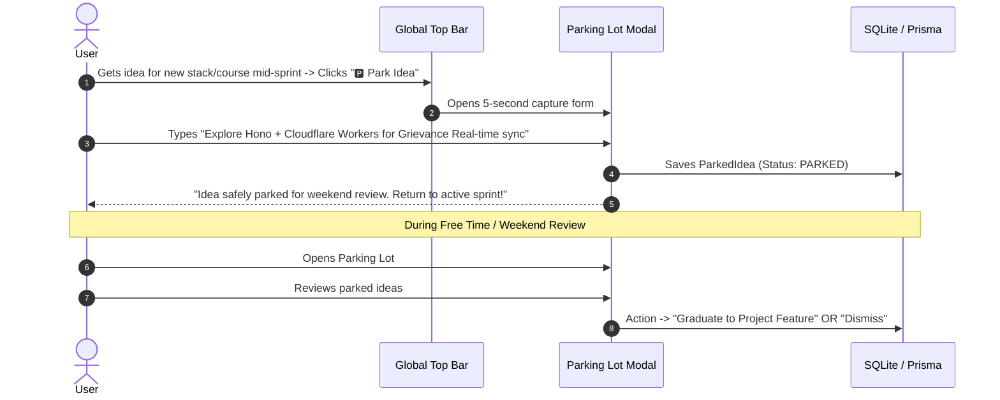
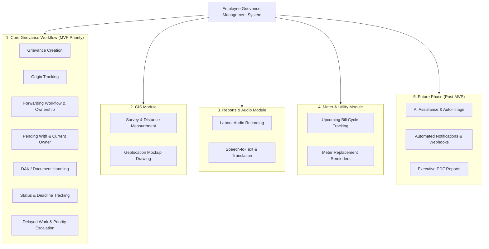

# Focus ⚡

> **Personal Execution & Career Transition Operating System**  
> *"Stop wasting time deciding what to study. Know what to do today, record what was actually done, and measure real progress."*

---

## 📑 Table of Contents

1. [Product Overview & Philosophy](#-product-overview--philosophy)
2. [Design & UI/UX Principles](#-design--uiux-principles)
3. [Architecture & Tech Stack](#-architecture--tech-stack)
4. [Core Modules & Functional Scope](#-core-modules--functional-scope)
   - [1. Master Dashboard & Smart Decision Engine](#1-master-dashboard--smart-decision-engine)
   - [2. Consistency Engine (Flexible 30m Success & 2-Day Red Alert)](#2-consistency-engine-flexible-30m-success--2-day-red-alert)
   - [3. Parking Lot Idea Garage](#3-parking-lot-idea-garage)
   - [4. DSA 80-Question Tracker](#4-dsa-80-question-tracker)
   - [5. Project Feature Tracker (Employee Grievance System)](#5-project-feature-tracker)
   - [6. Interview Preparation Hub](#6-interview-preparation-hub)
   - [7. Daily Growth, Reflection & Yearly Heatmap](#7-daily-growth-reflection--yearly-heatmap)
   - [8. Locked Roadmap & Anti-Planning Guardrails](#8-locked-roadmap--anti-planning-guardrails)
5. [Data Models & Prisma Schema](#-data-models--prisma-schema)
6. [API Endpoints Specification](#-api-endpoints-specification)
7. [Implementation Phases & Milestones](#-implementation-phases--milestones)
8. [Setup & Local Development](#-setup--local-development)

---

## 🎯 Product Overview & Philosophy

**CareerOS** is a personal-use productivity and execution system built for a developer transitioning to a **Full Stack / SDE-1** role at product companies (such as Zoho, Atlassian, and tier-1 product organizations).

### The Problem It Solves:
- **Decision Paralysis**: Spending 30–60 minutes every day opening YouTube, LeetCode, or Notion asking *"What should I study today?"*
- **Planning Trap**: Constant reorganization of roadmaps and task lists that creates the illusion of productivity without real code written.
- **All-or-Nothing Trap**: Feeling like a day is a failure if 4 hours weren't achieved, leading to skipped days.
- **Shiny Object Distraction**: Jumping into new frameworks, courses, or side ideas mid-week instead of finishing the active milestone.

### The 6 Core CareerOS Operating Invariants:
1. **Single Next Best Action**: The dashboard always highlights 1–3 immediate actions with exact time targets.
2. **Honest Time Accounting**: Only manually logged, focused execution (DSA problem solving, project feature development, interview revision) counts toward the daily target.
3. **Execution vs. Planning Ratio**: Tracks every roadmap tweak against actual work sessions to expose replanning loops.
4. **Flexible 30-Minute Success Rule**: 4h is the target, but **30+ minutes of verified work is counted as a streak-preserving success**. No rigid all-or-nothing despair.
5. **🚨 2-Day Blank Red Alert**: 2 consecutive zero-work days are **NOT acceptable**. The system triggers a high-priority red alert prompting a 15–30m micro-session to restore momentum immediately.
6. **Parking Lot for Distractions**: Capture new ideas, stacks, or course recommendations in 5 seconds without derailing the active sprint. Review and triage them only during free time.

---

## 🎨 Design & UI/UX Principles

- **Theme**: Dark mode only (Deep slate `#090d16`, dark card surfaces `#0f172a`, crisp borders `#1e293b`, electric blue/indigo accents).
- **Aesthetic**: **Linear + GitHub + Notion** developer-tool feel. Dense, clean typography (Inter / Geist Mono), minimalist data tables, subtle progress bars, and zero cartoonish gamification.
- **No Unnecessary Animations**: High-speed, instantaneous page switches and modal popovers.
- **Responsive & Desktop-First**: Optimized for a 13"-27" coding monitor with responsive collapsible sidebar on mobile.

```
┌────────────────────────────────────────────────────────────────────────────────────────┐
│ CAREEROS ⚡  [+ Log Session]  [🅿️ Parking Lot (3)]  [What Should I Do Now?] 📅 Tue 8 Sep │
├──────────────┬─────────────────────────────────────────────────────────────────────────┤
│ 🧭 Dashboard │ TODAY: Target 4h 00m | Actual 2h 45m (69%) | Status: 🟢 Studied (Pace)  │
│ 💻 DSA (80)  ├─────────────────────────────────────────────────────────────────────────┤
│ 🚀 Projects  │ NEXT ACTION: ⚡ DSA #37 Sliding Window (45 min)                          │
│ 🎯 Interview │ ----------------------------------------------------------------------- │
│ 🌱 Growth    │ THIS WEEK: 24h 30m / 32h (77%) | Streak: 🔥 6 Days (30m+ Min Daily)     │
│ 🗺️ Roadmap   │ Execution: 17 Sessions vs 2 Planning Edits (89% Execution Ratio)        │
└──────────────┴─────────────────────────────────────────────────────────────────────────┘
```

---

## 🏗 Architecture & Tech Stack



### Stack Details:
- **Frontend**: React 18, TypeScript, Tailwind CSS, Lucide React (icons), Vite.
- **Backend**: Node.js, Express.js, TypeScript runtime (`tsx` / `ts-node`), CORS, Dotenv.
- **Database & ORM**: SQLite for zero-config personal local setup (seamlessly upgradeable to PostgreSQL) with Prisma ORM.
- **Architecture**: Clean modular layered structure with typed API contracts and zero bloated external microservices.

---

## 📦 Core Modules & Functional Scope

### 1. Master Dashboard & Smart Decision Engine

The dashboard answers one core question: **"Am I actually moving forward today?"**

#### Key Components:
- **Today's Metric Bar**:
  - `Target Hours`: Calculated automatically (4h on Mon–Fri, 6h on Sat–Sun).
  - `Actual Hours`: Sum of logged work sessions today.
  - `Progress Bar & Percentage`: Real-time completion gauge.
  - `Status Badge`:
    - `0m`: ⚪ Inactive
    - `30m – 3h 59m`: 🟢 **Studied (Consistent Pace)**
    - `4h+` (`6h+` weekend): 🏆 **Target Met (Full Deep Work)**
- **Smart "What Should I Do Now?" Card**:
  - Evaluates: (1) Current roadmap priority, (2) Next unsolved question in locked DSA sequence, (3) Current project feature next action, (4) Weakest interview topic, (5) Today's remaining hours.
  - Displays strictly **1 to 3 prioritized actions** (e.g. *“1. Solve DSA #37 Sliding Window (45m)”*, *“2. Implement Grievance Forwarding API (90m)”*).
  - Direct **"Start / Log Work"** button on each card.
- **Weekly Execution Overview**:
  - Target: 32h (Weekdays 4h × 5 + Weekends 6h × 2).
  - Actual Hours Logged & Completion %.
  - 7-day breakdown (Mon through Sun) showing target vs actual per day.
  - Success days count (days with $\ge 30\text{ min}$) vs Missed days count ($0\text{ min}$).
- **Execution vs. Planning Ratio**:
  - Displays: Number of active work sessions vs number of roadmap/task edits.
  - Alerts if planning edits exceed threshold (*“Warning: You spent more time tweaking the plan than executing.”*).

---

### 2. Consistency Engine (Flexible 30m Success & 2-Day Red Alert)



#### The Rules:
1. **30 Minutes = Success**: A 4-hour target is the ideal stretch, but logging $\ge 30\text{ min}$ of focused code/DSA counts toward maintaining the daily streak and builds habit resilience.
2. **🚨 2-Day Blank Red Alert**:
   - If 2 consecutive days record $0$ minutes, a high-visibility **Red Alert Banner** locks onto the dashboard header.
   - Highlights the immediate danger of habit extinction.
   - Provides a single one-click recovery action: **"Start 15m Micro-Start (LC Easy / Grievance Fix)"** to clear the alert immediately.

---

### 3. Parking Lot Idea Garage

A frictionless holding area to prevent mid-sprint context switching and shiny-object syndrome.



#### Features:
- Quick global shortcut (`Ctrl+P` / `Cmd+P` or top bar button).
- Categories: `Tech Stack`, `New Course / Tutorial`, `Project Idea`, `Tool / Library`, `General`.
- One-click actions:
  - **Graduate to Project Feature**: Transfers the idea directly into the Employee Grievance Management System feature list.
  - **Dismiss / Archive**: Safely archives the idea.
  - **Keep Parked**: Holds for future review.

---

### 4. DSA 80-Question Tracker

A curated curriculum of **80 high-yield questions** covering essential product-company patterns in strict pedagogical order.

#### 1. The Locked 9-Topic Sequence:
1. `Array`
2. `HashMap / HashSet`
3. `Two Pointer`
4. `Sliding Window` *(Priority)*
5. `Binary Search`
6. `Stack`
7. `Queue`
8. `Linked List`
9. `Recursion`

#### 2. Progress Overview Header:
- Total Questions (80)
- Solved Count & In Progress Count
- Unsolved Count
- Overall Completion %
- Current Active Topic
- Next Recommended Problem

#### 3. Filterable Question Table:
- **Columns**: `#`, `Topic`, `Problem Title`, `Difficulty (Easy/Med/Hard)`, `Status`, `Solved Date`, `Independence (Self / Help)`, `Revision Needed`.
- **Search & Filter**: By topic, difficulty, status (`Not Started`, `In Progress`, `Solved`, `Needs Revision`), and revision flag.

#### 4. Problem Detail & Solution Modal:
- Problem title, topic, difficulty badge, LeetCode / external problem URL.
- Status toggle: `Not Started` $\rightarrow$ `In Progress` $\rightarrow$ `Solved` $\rightarrow$ `Needs Revision`.
- **Honest Solving Metric**: Toggle between **"I solved this myself"** vs **"I needed help / read solution"**.
- Code & Solution field (clean monospace viewer/editor).
- Approach & Pattern explanation field.
- **Mistake & Traps field**: Critical record of what went wrong or which edge case failed.
- Time & Space Complexity inputs ($O(N)$, $O(\log N)$, $O(1)$, etc.).
- Revision notes and **"Mark for Revision"** checkbox.

---

### 5. Project Feature Tracker

Designed for **Project A: Employee Grievance Management System** (with multi-project support).

#### Core Tracking Rules:
- Tracks projects **feature by feature** with explicit progress bars, not as a vague single percentage.
- Separates active **MVP Features** from **Future Ideas** to prevent scope creep.
- Highlights a prominent **Next Action** on every feature to eliminate hesitation when opening the code editor.

#### Module Categorization:



#### Feature Card / Table Fields:
- Feature Name & Detailed Description
- Category / Subsystem (Core, GIS, Reports, Meter, Future)
- Status: `Idea` $\rightarrow$ `Planned` $\rightarrow$ `Development` $\rightarrow$ `Testing` $\rightarrow$ `Complete`
- Priority: `High`, `Medium`, `Low`
- Progress Percentage ($0–100\%$)
- Target Completion Date
- **Next Action**: Concrete next engineering task (e.g. *"Implement Prisma schema relations for grievance forward history"*).
- Technical Work Completed log & architecture notes.

---

### 6. Interview Preparation Hub

Targeted for **Full Stack Developer / SDE** interviews (Zoho, product startups, enterprise product companies).

#### Topic Coverage:
- **Frontend**: JavaScript (Event loop, closures, prototypes, async), TypeScript (Generics, utility types, invariants), React (Hooks, Fiber, state colocation, rendering optimization), Redux Toolkit, Tailwind CSS.
- **Backend**: Node.js (Streams, clusters, event emitters), Express.js (Middleware, error boundaries), PostgreSQL & Prisma (Indexing, transactions, relations, foreign keys), REST API Design, Authentication & Security (JWT, refresh token rotation, cookies, RBAC), Database Normalization & ACID.
- **Interview Coding**: DSA patterns and standard whiteboard algorithms.
- **Next Month (Phase 2 - CS Fundamentals)**: OS (Processes, threads, locks), Computer Networks (TCP/IP, HTTP/HTTPS, DNS), DBMS (Transactions, indexing, isolation levels).

#### Topic Card & Metric View:
- Status: `Not Started` $\rightarrow$ `Learning` $\rightarrow$ `Practiced` $\rightarrow$ `Interview Ready`
- **Confidence Score ($1$ to $5$)**:
  - $1$: Blank / Unprepared
  - $2$: Basic theoretical understanding
  - $3$: Can code standard implementation
  - $4$: Can explain trade-offs and edge cases under interview pressure
  - $5$: Complete mastery / Production level
- Last Studied Date & Next Review Due Date.
- **Weakness Spotter**: Automatically flags critical topics with confidence $\le 2/5$.
- Topic Sheet Modal: Must-know interview questions, personal notes, and practical talking points.

---

### 7. Daily Growth, Reflection & Yearly Heatmap

#### 1. GitHub-Style Yearly Consistency Heatmap:
- Displays 365-day grid tracking daily execution percentage.
- **Color Scale**:
  - `0 min`: Slate dark (Blank / Inactive)
  - `30m – 1h 59m`: Low execution / Consistent (Dim blue/indigo)
  - `2h – 3h 59m`: Moderate execution (Bright indigo)
  - `4h+` (`6h+` weekend): Target Met (Vibrant emerald)
- **Interactive Day Popover**: Shows exact target, actual hours logged, DSA/Project/Interview distribution, and daily reflection.
- **Streak Counters**: Current continuous streak ($\ge 30\text{m}$ days), Longest streak, Days completed this month.

#### 2. The 2-Minute Daily Check-In Form:
- Quick questions completed at end of day:
  1. *Did I complete my planned study target today?* (Yes/No)
  2. *Did I spend too much time deciding what to study?* (Yes/No)
  3. *Activities completed today*: [ ] DSA [ ] Project [ ] Interview Prep
  4. *Energy Level*: 1 to 5 stars
  5. *Focus Level*: 1 to 5 stars
  6. *One Thing I Learned Today* (Text)
  7. *One Mistake / Pitfall Made Today* (Text)
  8. *Tomorrow's Single Non-Negotiable Priority* (Text)

---

### 8. Locked Roadmap & Anti-Planning Guardrails

- Clearly separates **Current Phase** from **Future Phases**.
- **Phase 1 (Active Month)**:
  - DSA 80 Questions sequence.
  - Employee Grievance Management System (Core workflows).
  - Core Full Stack interview preparation (JS, TS, React, Node, Postgres).
- **Phase 2 (Next Month)**:
  - CS Fundamentals (OS, DBMS, Networks), System Design basics.
- **Roadmap Lock Status**: Keeps focus squarely on Phase 1 deliverables without allowing daily restructuring.

---

## 🗄 Data Models & Prisma Schema

```prisma
datasource db {
  provider = "sqlite"
  url      = "file:./career_os.db"
}

generator client {
  provider = "prisma-client-js"
}

model User {
  id              String           @id @default(cuid())
  name            String           @default("Engineer")
  createdAt       DateTime         @default(now())
  updatedAt       DateTime         @updatedAt
  dsaQuestions    DSAQuestion[]
  projects        Project[]
  interviewTopics InterviewTopic[]
  workSessions    WorkSession[]
  dailyReviews    DailyReview[]
  roadmapItems    RoadmapItem[]
  parkedIdeas     ParkedIdea[]
}

model DSAQuestion {
  id              String    @id @default(cuid())
  userId          String
  user            User      @relation(fields: [userId], references: [id], onDelete: Cascade)
  number          Int       // 1 to 80
  topic           String    // Array, HashMap, Two Pointer, Sliding Window, Binary Search, Stack, Queue, LinkedList, Recursion
  title           String
  difficulty      String    // Easy, Medium, Hard
  problemUrl      String?
  status          String    @default("NOT_STARTED") // NOT_STARTED, IN_PROGRESS, SOLVED, NEEDS_REVISION
  solvedMyself    Boolean   @default(true) // true = solved myself, false = needed help
  solution        String?
  approach        String?
  mistake         String?
  timeComplexity  String?   // O(N), O(log N), etc.
  spaceComplexity String?   // O(1), O(N), etc.
  dateSolved      DateTime?
  needsRevision   Boolean   @default(false)
  revisionNotes   String?
  createdAt       DateTime  @default(now())
  updatedAt       DateTime  @updatedAt
}

model Project {
  id          String           @id @default(cuid())
  userId      String
  user        User             @relation(fields: [userId], references: [id], onDelete: Cascade)
  name        String           // e.g. "Employee Grievance Management System"
  description String?
  status      String           @default("IN_PROGRESS") // PLANNED, IN_PROGRESS, COMPLETED
  githubUrl   String?
  demoUrl     String?
  isFlagship  Boolean          @default(true)
  features    ProjectFeature[]
  createdAt   DateTime         @default(now())
  updatedAt   DateTime         @updatedAt
}

model ProjectFeature {
  id             String    @id @default(cuid())
  projectId      String
  project        Project   @relation(fields: [projectId], references: [id], onDelete: Cascade)
  category       String    @default("CORE") // CORE, GIS, REPORTS, METER, FUTURE
  name           String
  description    String?
  status         String    @default("PLANNED") // IDEA, PLANNED, DEVELOPMENT, TESTING, COMPLETE
  priority       String    @default("HIGH") // HIGH, MEDIUM, LOW
  progress       Int       @default(0) // 0 - 100%
  targetDate     DateTime?
  nextAction     String?   // Concrete next task to code
  technicalNotes String?
  isMvp          Boolean   @default(true) // false for future ideas
  createdAt      DateTime  @default(now())
  updatedAt      DateTime  @updatedAt
}

model InterviewTopic {
  id             String    @id @default(cuid())
  userId         String
  user           User      @relation(fields: [userId], references: [id], onDelete: Cascade)
  category       String    // FRONTEND, BACKEND, CODING, CS_FUNDAMENTALS
  name           String    // JavaScript, React, Node.js, PostgreSQL, etc.
  status         String    @default("LEARNING") // NOT_STARTED, LEARNING, PRACTICED, INTERVIEW_READY
  confidence     Int       @default(3) // 1 to 5
  priority       String    @default("HIGH") // CRITICAL, HIGH, MEDIUM, LOW
  phase          String    @default("PHASE_1") // PHASE_1 (current month), PHASE_2 (next month)
  lastStudied    DateTime?
  nextReview     DateTime?
  notes          String?
  keyQuestions   String?
  practicalTips  String?
  createdAt      DateTime  @default(now())
  updatedAt      DateTime  @updatedAt
}

model WorkSession {
  id              String    @id @default(cuid())
  userId          String
  user            User      @relation(fields: [userId], references: [id], onDelete: Cascade)
  date            String    // YYYY-MM-DD
  category        String    // DSA, PROJECT, INTERVIEW, OTHER
  durationMinutes Int
  taskTitle       String
  notes           String?
  dsaQuestionId   String?
  projectFeatureId String?
  createdAt       DateTime  @default(now())
}

model DailyReview {
  id               String   @id @default(cuid())
  userId           String
  user             User     @relation(fields: [userId], references: [id], onDelete: Cascade)
  date             String   // YYYY-MM-DD
  targetHours      Float
  actualHours      Float
  energy           Int      @default(3) // 1 to 5
  focus            Int      @default(3) // 1 to 5
  completedPlanned Boolean  @default(false)
  spentTooMuchTimeDeciding Boolean @default(false)
  didDsa           Boolean  @default(false)
  didProject       Boolean  @default(false)
  didInterview     Boolean  @default(false)
  oneThingLearned  String?
  oneMistake       String?
  tomorrowPriority String?
  planningChanges  Int      @default(0) // Count of roadmap/task re-organizations
  createdAt        DateTime @default(now())
  updatedAt        DateTime @updatedAt

  @@unique([userId, date])
}

model ParkedIdea {
  id          String    @id @default(cuid())
  userId      String
  user        User      @relation(fields: [userId], references: [id], onDelete: Cascade)
  title       String
  category    String    @default("TECH_IDEA") // TECH_STACK, COURSE, PROJECT_IDEA, TOOL, GENERAL
  notes       String?
  status      String    @default("PARKED") // PARKED, GRADUATED, DISMISSED
  graduatedFeatureId String?
  createdAt   DateTime  @default(now())
  updatedAt   DateTime  @updatedAt
}

model RoadmapItem {
  id          String    @id @default(cuid())
  userId      String
  user        User      @relation(fields: [userId], references: [id], onDelete: Cascade)
  phase       String    @default("PHASE_1") // PHASE_1 (Current Month), PHASE_2 (Next Month)
  name        String
  category    String    // DSA, PROJECT, INTERVIEW, CS_CORE
  priority    String    @default("PRIMARY") // PRIMARY, SECONDARY, UPCOMING
  status      String    @default("ACTIVE") // ACTIVE, COMPLETED, QUEUED
  targetDate  DateTime?
  notes       String?
  createdAt   DateTime  @default(now())
  updatedAt   DateTime  @updatedAt
}
```

---

## 🔌 API Endpoints Specification

### Dashboard & Recommendation
- `GET /api/dashboard/summary` — Returns today's target/actual hours, status (`INACTIVE`, `STUDIED_PACE`, `TARGET_MET`), 2-day red alert flag, next 1–3 best actions, weekly breakdown, execution vs planning count, and streaks.
- `GET /api/dashboard/recommendation` — Smart engine delivering the next single highest-leverage action.

### Parking Lot
- `GET /api/parking-lot` — Retrieves all parked ideas.
- `POST /api/parking-lot` — Parks a new idea or distraction (`title`, `category`, `notes`).
- `PUT /api/parking-lot/:id` — Updates idea status (`PARKED`, `GRADUATED`, `DISMISSED`).
- `DELETE /api/parking-lot/:id` — Removes a parked idea.

### Work Session Logging
- `GET /api/work-sessions?date=YYYY-MM-DD` — Lists sessions for a given date.
- `POST /api/work-sessions` — Logs a new work session (`category`, `durationMinutes`, `taskTitle`, `notes`).
- `DELETE /api/work-sessions/:id` — Deletes a logged session.

### DSA Tracker
- `GET /api/dsa/questions` — Returns all 80 questions with progress stats.
- `GET /api/dsa/questions/:id` — Returns single question details.
- `PUT /api/dsa/questions/:id` — Updates solution, status, mistakes, complexities, revision flag, and honest solve indicator.

### Project Tracker
- `GET /api/projects` — Returns projects with feature lists, progress calculations, and next actions.
- `POST /api/projects/:id/features` — Adds a new feature under a project.
- `PUT /api/projects/features/:featureId` — Updates feature status, progress, next action, and notes.

### Interview Preparation
- `GET /api/interview/topics` — Returns topics grouped by category, weak spots, and readiness scores.
- `PUT /api/interview/topics/:id` — Updates confidence score, notes, last studied date, and readiness status.

### Daily Growth & Heatmap
- `GET /api/growth/heatmap?year=2026` — Returns 365-day execution data for the GitHub heatmap.
- `GET /api/growth/review?date=YYYY-MM-DD` — Gets check-in review for a specific day.
- `POST /api/growth/review` — Submits the 2-minute daily reflection form.

### Roadmap
- `GET /api/roadmap` — Returns current phase items vs future phase items and planning change metrics.

---

> 📖 **Deep Dive**: For full sequence diagrams and step-by-step traces of every feature from UI component to Prisma database queries, see [FLOW.md](FLOW.md).

---

## 🗓 Implementation Phases & Milestones

```
Phase 1: Project Scaffolding, SQLite Database & Prisma Models
├── Initialize React + Vite + TailwindCSS (Dark Mode Linear aesthetic)
├── Setup Express + TypeScript server with Prisma ORM
└── Seed 80 DSA Questions, Grievance System Features, Interview Topics, Parked Ideas

Phase 2: Master Dashboard & Smart Recommendation Engine
├── Today's Target (4h/6h) vs Actual Hours calculation
├── 30m Success Level & 2-Day Red Alert banner logic
├── Smart "What Should I Do Now?" next-best-action logic
└── Weekly execution bar & Execution vs Planning indicator

Phase 3: Fast Session Logger & Parking Lot Modals
├── Global Quick Log (< 10s work session submission)
├── Global Parking Lot Drawer (5s distraction capture)
└── Instant re-computation of day progress, streak, and heatmap

Phase 4: DSA 80-Question Tracker
├── Filterable question table (Array → Recursion)
├── Question detail & solution modal (Mistakes, complexity, self/help solve)
└── Revision filter & status badges

Phase 5: Project Feature Tracker
├── Employee Grievance Management System feature tree
├── MVP vs Future Ideas isolation
└── Prominent "Next Action" workflow

Phase 6: Interview Preparation Hub
├── Category breakdown (JS, TS, React, Node, Postgres/Prisma)
├── 1-5 Confidence scoring and Weakness detection
└── Detailed interview question sheet modal

Phase 7: Daily Growth, Reflection & Yearly Streak Heatmap
├── GitHub-style 365-day execution heatmap
├── Day popover with breakdown
└── 2-minute daily check-in form

Phase 8: Roadmap Screen & Anti-Planning Guardrails
└── Phase 1 (Current Month) vs Phase 2 (Next Month) display
```

---

## 🚀 Setup & Local Development

### 1. Requirements
- Node.js `v18.0.0` or higher
- npm `v9.0.0` or higher

### 2. Quick Start
```bash
# 1. Install dependencies
npm install

# 2. Initialize and seed SQLite database
npx prisma db push
npx tsx prisma/seed.ts

# 3. Start Frontend & Backend concurrently
npm run dev
```

- **Frontend Application**: `http://localhost:5173`
- **Backend API Server**: `http://localhost:3001/api`

---

<div align="center">
  <sub>Built for daily discipline, zero decision fatigue, and career velocity. CareerOS.</sub>
</div>
